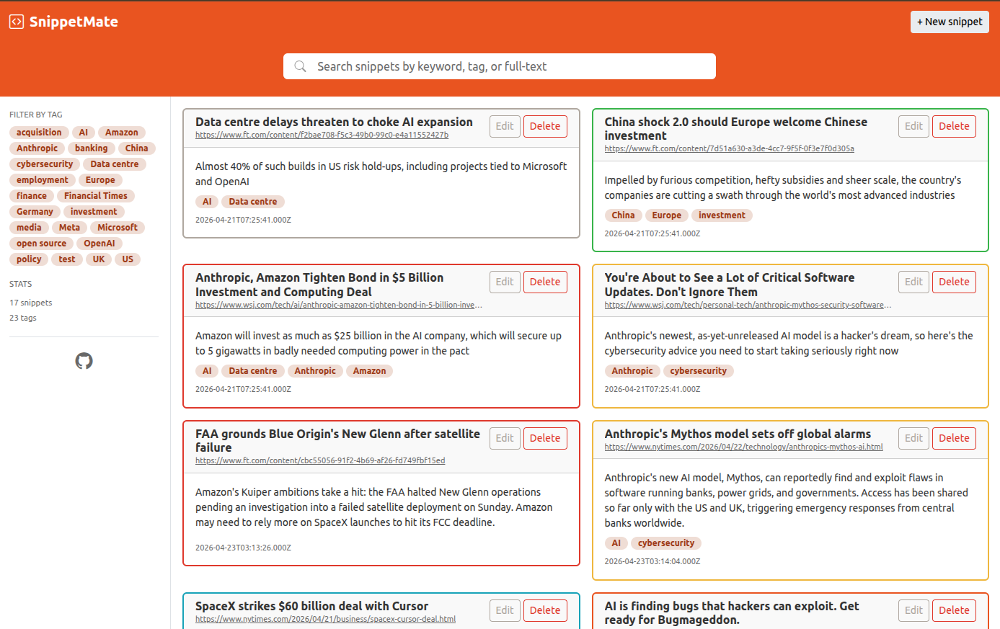

#  SnippetMate

**Paste it. Tag it. Find it.**

SnippetMate is a single-page web application (SPA) for capturing short text or code snippets from the web, including AI prompts and AI responses. You can tag your snippets, then search by title, tag, or even by full-text.

Each user signs in with their Google account and gets a private, isolated collection — your snippets are yours alone, scoped to your account on every request.

Your "SnippetMate" lives in your browser while you're reading the news, browsing the web, or working on coding sites and documentation sites like MDN or SourceForge.



## Tech Stack

- **Frontend:** Vue 3 + Vite + Bootstrap 5 (with the Bootswatch "United" theme) + SweetAlert2 (pop-ups) + Firebase Web SDK (Google sign-in)
- **Backend:** Node.js + Express, with `firebase-admin` verifying a Google ID token on every data request
- **Database:** MySQL 8 (FULLTEXT index on title and content, a many-to-many snippet–tag schema, and per-user ownership)

No external **data** APIs are used. Firebase is used only for authentication (Google sign-in).

## Features

### The two required dynamic aspects

These are the two required dynamic aspects (front-end JavaScript talking to the back-end):

1. **CRUD with search and tag filtering** — Create, Read, Update and Delete snippets, with full-text search across the title and content, plus a tag-based sidebar filter.
2. **Server-side URL title fetching** — You paste a source URL, then (optionally) click *Fetch title*, and the back-end retrieves the page title and fills it into the form.

### Additional features

- **Google sign-in & multi-user isolation** — Firebase Authentication; every snippet and tag query is scoped to the signed-in user.
- **Markdown export** — export a single snippet or the whole collection as Markdown.
- **JSON import / export** *(new in v2.1.0)* — a canonical JSON round-trip for backup and restore, with duplicate-skipping and tag reconciliation on import.

## Import / Export JSON format

**Export JSON** downloads your collection in the shape below; **Import** accepts the same shape, so an export round-trips cleanly back in.

```json
{
  "format": "snippetmate-export",
  "version": 1,
  "snippets": [
    {
      "title": "Composables | Vue.js",
      "content": "What is a \"Composable\"? ...",
      "source_url": "https://vuejs.org/guide/reusability/composables",
      "tags": ["Vue.js"]
    }
  ]
}
```

Rules the importer enforces:

- `format` must be `"snippetmate-export"` and `version` must be `1`, or the file is rejected.
- Each snippet requires `title` and `content`; `source_url` and `tags` are optional. A row missing a required field is skipped and reported in the response, while valid rows still import.
- `tags` is an array of tag names; existing tags are reused, new ones are created.
- No `id` or `user_id` is read from the file — ownership comes from your signed-in account, and IDs are generated by the database. Importing your own export is a no-op (the snippets already exist, so they are skipped).
- A single import is capped at 1000 snippets.

## Project Layout

```
SnippetMate/
├── backend/            Node.js + Express API
│   ├── routes/         /api/health, /api/snippets (incl. /import + /export),
│   │                   /api/tags, /api/fetch-title
│   ├── middleware/     auth.js — verifies the Firebase ID token, scopes by user
│   ├── test/           Integration tests using node:test + supertest
│   ├── db.js           MySQL connection pool (mysql2/promise)
│   ├── firebase.js     Firebase Admin SDK init (loads the service-account key)
│   ├── server.js       Express entry point
│   └── .env.example
├── db/
│   ├── schema.sql      Table definitions (users, snippets, tags, snippet_tags)
│   └── seed.sql        Optional sample data, owned by a demo user
└── frontend/           Vue 3 + Vite single-page app
    └── src/
        ├── components/   NavBar, SearchBar, TagSidebar, SnippetList,
        │                 SnippetCard, SnippetFormModal
        ├── services/     api.js (axios wrapper; attaches the auth token)
        ├── firebase.js   Firebase Web SDK init (reads VITE_FIREBASE_* env vars)
        ├── App.vue
        └── main.js
```

## Requirements

- Node.js 20 or newer
- MySQL 8 or newer
- Git
- A **Firebase project** with Google sign-in enabled (the free Spark plan is sufficient)

## Installation

### 1. Clone the repository

```bash
git clone https://github.com/hexawulf/SnippetMate.git
cd SnippetMate
```

### 2. Set up the database

Log into MySQL as an admin user (root) that can create databases and users:

```bash
sudo mysql
```

Create the database and a dedicated app user (for example `snippetmate_user`):

```sql
CREATE DATABASE snippetmate CHARACTER SET utf8mb4 COLLATE utf8mb4_unicode_ci;
CREATE USER 'snippetmate_user'@'localhost' IDENTIFIED BY 'your_password_here';
GRANT ALL PRIVILEGES ON snippetmate.* TO 'snippetmate_user'@'localhost';
FLUSH PRIVILEGES;
EXIT;
```

Replace `your_password_here` with a secure password of your choice; you'll put it in the `.env` file in step 4.

Load the schema (this creates the `users`, `snippets`, `tags`, and `snippet_tags` tables). You can optionally also load the sample data:

```bash
mysql -u snippetmate_user -p snippetmate < db/schema.sql
mysql -u snippetmate_user -p snippetmate < db/seed.sql
```

The seed data is owned by a demo user, so once you sign in with your own Google account you start with an empty collection — that's the correct multi-user behavior.

### 3. Set up a Firebase project

SnippetMate uses Firebase Authentication for Google sign-in. You need your own Firebase project:

1. In the [Firebase console](https://console.firebase.google.com/), create a new project.
2. **Authentication → Sign-in method →** enable **Google**.
3. **Project settings → General → Your apps →** register a **Web app**; copy the `firebaseConfig` values (`apiKey`, `authDomain`, `projectId`, `storageBucket`, `messagingSenderId`, `appId`) for step 5.
4. **Project settings → Service accounts → Generate new private key.** Save the downloaded JSON file **outside the repository** (e.g. `~/secrets/snippetmate/firebase-service-account.json`) and restrict its permissions:

   ```bash
   chmod 600 ~/secrets/snippetmate/firebase-service-account.json
   ```

   The frontend Web app and the backend service account must belong to the **same Firebase project** — that's what makes token verification work end to end.

### 4. Configure the backend environment

```bash
cd backend
cp .env.example .env
```

Open `.env` and set:

- `DB_PASSWORD` — the password you chose in step 2.
- `GOOGLE_APPLICATION_CREDENTIALS` — the **absolute path** to the service-account JSON from step 3 (e.g. `/home/you/secrets/snippetmate/firebase-service-account.json`).

The other variables can stay at their defaults.

### 5. Configure the frontend environment

In the `frontend/` folder, create `.env.local` with the Web app config from step 3:

```bash
# frontend/.env.local
VITE_FIREBASE_API_KEY=your_api_key
VITE_FIREBASE_AUTH_DOMAIN=your_project.firebaseapp.com
VITE_FIREBASE_PROJECT_ID=your_project
VITE_FIREBASE_STORAGE_BUCKET=your_project.firebasestorage.app
VITE_FIREBASE_MESSAGING_SENDER_ID=your_sender_id
VITE_FIREBASE_APP_ID=your_app_id
```

Both `backend/.env` and `frontend/.env.local` are gitignored — never commit them or the service-account key.

### 6. Install backend dependencies and start the server

```bash
cd backend
npm install
npm start
```

The backend starts on `http://localhost:3000`.

### 7. Install frontend dependencies and start the dev server

In a new terminal:

```bash
cd frontend
npm install
npm run dev
```

Vite starts on `http://localhost:5173`. Open that URL, sign in with Google, and start capturing snippets.

## Running the Tests

The backend has integration tests covering the health check, tag listing, tag filtering, the full snippet CRUD lifecycle, the JSON import/export endpoints (envelope validation, duplicate-skipping, malformed-row reporting), authentication boundaries (401 without a token), and a second-user round-trip that confirms per-user isolation.

```bash
cd backend
npm test
```

Tests run against the MySQL database configured in `.env` and clean up after themselves.

## Deployment

The live instance runs at **[snippetmate.com](https://snippetmate.com)** on a Linux host: the built Vue SPA is served by nginx, the Express backend runs as a managed process behind an nginx reverse proxy, and MySQL runs locally. Cloudflare fronts TLS and DNS. Remember to add your production domain to **Firebase → Authentication → Settings → Authorized domains**, or Google sign-in is rejected with `auth/unauthorized-domain`.

## Course Information

Course: DLBCSPJWD01 — Project Java and Web Development
IU International University of Applied Sciences

## Author

Erling Wulf Weinreich
B.Sc. Computer Science, IU International University of Applied Sciences
erling-wulf.weinreich@iu-study.org

## License

This project is licensed under the [MIT License](LICENSE).
